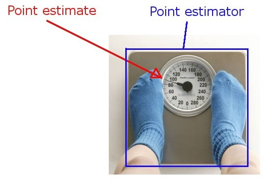
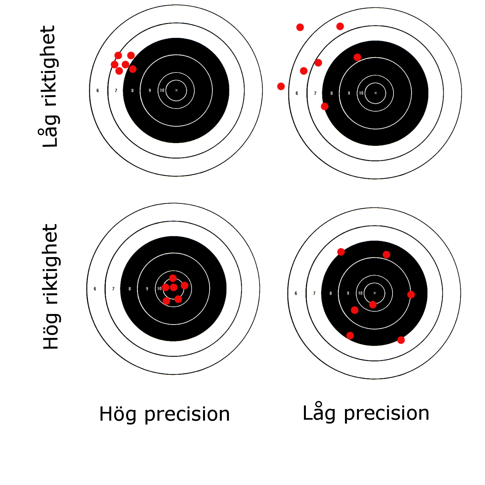

```{r setup, include=FALSE}
knitr::opts_chunk$set(echo = FALSE)
handout <- FALSE
```
```{r, echo = handout}
# Data och förberedelse

set.seed(1) # För att kunna reproducera

# Luftkonditionering, tider mellan fel (från Cox, D.R. and Snell, E.J. (1981))
ac <- c(90, 10, 60, 186, 61, 49, 14, 24, 56, 20, 79, 84, 44, 59, 29, 118, 25, 156, 310, 76, 26, 44, 23, 62, 130, 208, 70, 101)

```

```{r, echo = handout}
## Funktioner

# Täthet för invers Gammafördelning 
dinvgamma <- function(x, alpha, beta){
        # Bestämmer täthet för invers Gamma-fördelning i punkten x
        # Argument:
        #     x: funktionsargument
        #     alpha: formparameter
        #     beta: skalparameter
        # Utdata:
        #     täthetens värde i x
        #
    (beta^alpha / gamma(alpha)) * x^(-alpha - 1) * exp(- beta / x)
}
```


# Frekventistisk statistik

## Skattning och skattare


```{r, out.width = "600px"}

```


## Skattning och skattare

<div class="boxed"> **Definition:** (Skattning/Skattare, H & B, def. 3.1) Antag att vi modellerar data $x$ som en realisering av en stokastisk variabel $X\sim P_{\theta_0}$. Med *skattning* syftar vi på ett numerisk värde $t=\hat{\theta}(x)$, med *skattare* syfter vi på funktionen $\hat{\theta}:\mathcal{T}\rightarrow\Theta$ alternativt den stokastiska variabeln $T=\hat{\theta}(X)$, $X\sim P_{\theta}$.
</div>


## Riktighet och precision (accuracy/trueness and precision)

```{r, out.width = "500px"}

```

## Egenskaper hos skattare {.build}

<div class="boxed"> **Definition:** (Medelkvadratfel, H & B (3.4)) En skattare $\hat{\theta}(\cdot)$:s medelkvadratfel är $$MSE(\theta)=E_\theta (\hat{\theta}(X)-\theta)^2=Var_\theta(\hat{\theta}(X))+(E_\theta[\hat{\theta}(X)-\theta])^2.$$
</div>

<div class="boxed"> **Definition:** (H & B, Def. 3.2) En skattare $\hat{\theta}(\cdot)$:s bias (väntevärdesfel, systematiska fel) är $$E_\theta(\hat{\theta}(X)-\theta).$$ Om $E_\theta(\hat{\theta}(X)-\theta)=0$ för alla $\theta\in\Theta$ säges $\hat{\theta}(\cdot)$ vara väntevärdesriktig (unbiased).
</div>

## Livslängder

Om $X_1, \ldots X_n$ är oberoende $Exp(\theta)$ så är 

- $M=n^{-1}\sum_{i=1}^n X_i\sim Gamma(n,n\theta)$ och $\hat{\theta}(X)=1/M\sim InvGamma(n,n\theta)$ med 
- väntevärde $E_\theta(\hat{\theta}(X))=n\theta/(n-1)$
- varians $Var_\theta(\hat{\theta}(X))=n^2\theta/((n-1)^2(n-2))$

## Två problem: 
Vi vill beskriva osäkerheten i en skattning $\hat{\theta}$ med hjälp av fördelningen hos $\hat{\theta}(X)$, $X\sim P_{\theta_0}$, men...

- denna beror på okända $\theta_0$
- även om vi vet $\theta_0$, är det endast möjligt att bestämma fördelningen analytiskt i enkla fall.

# Bootstrap

## Monte Carlo integrering
Vi kan approximera ett väntevärde $m=E(g(X))$, $X\sim P$, med godtycklig noggrannhet genom att

- Simulera $x_1,\ldots, x_N$ från $P$.
- Approximera $m$ med $\hat{m}=N^{-1}\sum_{i=1}^N g(x_i)$.

## Monte Carlo integrering

```{r, echo = TRUE}
x <- runif(100000)
mean(sin(1 / x))
```
```{r, echo = TRUE}
x <- runif(100000)
mean(sin(1 / x))
```

## Bootstrap (Plug-in + Monte Carlo)

Vi vill skatta egenskap hos $P_{\theta_0}$, t.ex. $$\phi_0=Var_{\theta_0}(\hat{\theta}(X))=h(\theta_0),$$
men saknar såväl $\theta_0$ som användbart uttryck för $h(\cdot)$.

## Bootstrap (Plug-in + Monte Carlo)

- **Plug-in:** Skatta $P_{\theta_0}$ med $P_{\hat{\theta}}$ ($h(\theta_0)$ med $h(\hat{\theta})$).
- **Monte Carlo:** Approximera $h(\hat{\theta})$ genom att
simulera $N$ nya stickprov $x_1^*,\ldots, x_N^*$, $x_i^*\in\mathcal{T}$, från $P_{\hat{\theta}}$ och använd dessa för att empiriskt approximera storheten av intresse.

## Bootstrap (Plug-in + Monte Carlo)

Med  $\phi=h(\theta_0)=Var_{\theta_0}(\hat{\theta}(X)),$ använder vi
$$
\hat{\phi}=\frac{1}{N-1}\sum_{i=1}^N(\theta^*_i-\bar{\theta^*})^2\approx h(\hat{\theta}).
$$
där $\theta^*_i=\hat{\theta}(x_i^*)$.

## Bootstrap, livslängder

Vad är fördelningen för $\hat{\theta}(X), X\sim P_\hat{\theta}$?

```{r, echo=TRUE}
# Dra N stickprov av storlek 28 från anpassad Exponentialfördelning
# Bestäm ML-skattning för varje stickprov och spara i theta.boot
theta.hat <- 1 / mean(ac)
N <- 10000
theta.boot <- numeric(10000)
for (i in 1:N){
    x <- rexp(28, rate = theta.hat)
    theta.boot[i] <- 1 / mean(x)
}
```

## Bootstrap, livslängder
```{r, echo = TRUE}
hist(theta.boot, xlab = expression(hat(theta)(X)))
```


## Bootstrap, livslängder

Bias

```{r, echo = TRUE}
bias.theta <- mean(theta.boot)-theta.hat
bias.theta
```

en numerisk approximation av

```{r, echo = TRUE}
theta.hat / 27
```

## Bootstrap, livslängder

Standardfel

```{r, echo = TRUE}
se.theta <- sd(theta.boot)
se.theta
```

en numerisk approximation av

```{r, echo = TRUE}
28 * theta.hat / (27 * sqrt(26))
```


## Bootstrap, livslängder

Låt $\phi_0=P_{\theta_0}(X_i>100)=\exp(-\theta_0 100)$. 

Plug-in skattning är $\hat{\phi}=P_{\hat{\theta}}(X_i>100)=\exp(-\hat{\theta} 100)$ med numeriskt standardfel
```{r, echo = TRUE}
phi.boot <- exp(-theta.boot * 100)
se.phi <- sd(phi.boot)
se.phi
```

## Icke-parametrisk Bootstrap
Antag $x_1,\ldots, x_n$ är oberoende realiseringar av $X$ med fördelningsfunktion $F_0$.

- Vi skattar $F_0$ med empiriska fördelningsfunktionen,
$$
\hat{F}(\cdot)=\frac{1}{n}\sum_{i=1}^n \mathbf{1}\{x_i\leq \cdot\}
$$
- Ett stickprov från $\hat{F}$ fås genom dragning med återläggning från $\{x_1,\ldots,x_n\}$.
- Upprepa...

## Icke-parametrisk Bootstrap, Livslängder

```{r, echo = TRUE}
# Dra N stickprov av storlek 28 från empirisk fördelning
# Bestäm skattning för varje stickprov och approximera standardfel
N <- 10000
theta.np.boot <- numeric(10000)
for (i in 1:N){
    x <- sample(ac, size = 28, replace = TRUE)
    theta.np.boot[i] <- 1 / mean(x)
}
se.np.theta <- sd(theta.np.boot)
se.np.theta
```

# Asymptotik

## Konvergens i sannolikhet {.build}

<div class="boxed"> **Definition:** (Konvergens i sannolikhet, H & B A.4.1)
En sekvens stokastiska variabler $T_n$, $n=1,\ldots$ konvergerar i sannolikhet mot $T$ om $P(|T_n-T|>\epsilon)\rightarrow 0$ då $n\rightarrow \infty$ för alla $\epsilon>0$.
</div>

<div class="boxed"> **Definition:** (Konsistens, H & B Def. 3.4) En (sekvens) skattare $T_n=\hat{\theta}(X_{1:n})$, $n=1, \dots$, säges vara en konsistent (sekvens) skattare av $\theta$ om den konvergerar mot $\theta$ i sannolikhet då $n\rightarrow\infty$ för alla $\theta$. Den är vidare konsistent i medelkvadrat om $MSE(\theta)\rightarrow 0$ för alla $\theta$.
</div>


## Stora talens lag {.build}

<div class="boxed"> **Sats:** (Stora talens lag, H & B, A.4.3) Låt $X_1, \ldots, X_n$ vara oberoende likafördelade med $E(X_i)=\mu$. 

Då konvergerar $T_n=n^{-1}\sum_{i=1}^n X_i$ mot $\mu$ i sannolikhet då $n\rightarrow \infty$.
</div>

<div class="boxed"> **Continuous mapping theorem:** (H & B, A.4.2)
Om $T_n$ konvergerar i sannolikhet mot $T$ och $g$ är kontinuerlig så konvergerar $g(T_n)$ i sannolikhet mot $g(T)$.
</div>

## Konvergens i fördelning

<div class="boxed"> **Definition:** (Konvergens i fördelning, H & B A.4.1)
En sekvens stokastiska variabler $T_n$, $n=1,\ldots$ konvergerar i fördelning mot $T$ om 
$F_n(t)=P(T_n\leq t)$ konvergerar mot $F(t)=P(T\leq t)$ för alla $t$ där $F$ är kontinuerlig.
</div>

## Centrala gränsvärdessatsen och deltametoden {.build}

<div class="boxed"> **Sats:** (Centrala gränsvärdessatsen, H & B A.4.4) Låt $X_1, \ldots, X_n$ vara oberoende likafördelade med $E(X_i)=\mu$ och $Var(X_i)=\sigma^2$. 

Då konvergerar $T_n=\sqrt{n}(n^{-1}\sum_{i=1}^n X_i-\mu)$ mot $T\sim N(0,\sigma^2)$ i fördelning då $n\rightarrow \infty$.
</div>


<div class="boxed"> **Sats:** (Deltametoden, H & B A.4.5) Antag att $\sqrt{n}(T_n-\theta)$ konvergerar i fördelning mot $N(0,\sigma^2)$ och låt $g$ vara en funktion sådan att $g'(\theta)\neq 0$.

Då konvergerar $\sqrt{n}(g(T_n)-g(\theta))$ i fördelning mot $N(0,\sigma^2g'(\theta)^2)$.
</div>

# Standardfel och konfidensintervall

## Standardfel

H & B använder en generisk definition av begreppet standardfel:

<div class="boxed"> **Definition:** (H & B, Def. 3.6) En skattning $\hat{\theta}$:s  standardfel är $se(\hat{\theta})=\sqrt{v_n}$, där $V_n$ är en konsistent skattare av $Var(T_n)$ i meningen att $V_n/Var(T_n)\rightarrow 1$  i sannolikhet då $n\rightarrow\infty$.
</div>


## Konfidensintervall

<div class="boxed"> **Definition:** (H & B, Def. 3.6) 

Låt $T_l=h_l(X)<h_u(X)=T_u$ vara två stickprovsvariabler. Om $P_\theta(T_l\leq\theta\leq T_u)=\gamma$ för alla $\theta$ och $x$ är en realisering av $X\sim P_{\theta_0}$ säges $(t_l,t_u)=(h_l(x),h_u(x))$ vara ett konfidensintervall för $\theta_0$ med konfidensgrad $\gamma$.
</div>

Hur bestämmer vi $h_l$ och $h_u$ för ett givet $\gamma$?

## Konfidensintervall

Ett konfidensintervall är en *intervallskattning*. En *punktskattning* är då

- en punkt (d.v.s. $\hat{\theta}$) som skattar någonting (t.ex. punkten $\theta_0$)?

- någonting (t.ex. punkten $\hat{\theta}$) som skattar en punkt (d.v.s. $\theta_0$)?

## Pivåvariabel

<div class="boxed"> **Definition:** (H & B, Def. 3.7)
En pivåvariabel är en funktion $g(x, \theta)$ sådan att fördelningen för $g(X,\theta)$ inte beror på $\theta$ då $X\sim P_\theta$.

En funktion $g_n(x_{1:n}, \theta)$ sådan att gränsfördelningen (då $n\rightarrow\infty$) för $g_n(X_{1:n},\theta)$ inte beror på $\theta$ är en approximativ/asymptotisk pivåvariabel.
</div>

## Konfidensintervall, livslängder

Ett 95%-igt intervall ges av
```{r, echo = TRUE}
C.1 <- qgamma(c(0.025, 0.975), 28, 1) / sum(ac)
C.1
```


## Wald-intervall

Låt $T_n=\hat{\theta}(X_1,\ldots,X_n)$ vara konsistent och asymptotiskt normalfördelad så att
$$
\frac{T_n-\theta}{\sqrt{Var(T_n)}}\rightarrow N(0,1),
$$
i fördelning då $n\rightarrow\infty$, $X\sim P_\theta^n$. 

Då ges ett Wald-intervall med approximativ konfidensgrad $\gamma$ av 
$$
\hat{\theta}\pm z_{(1+\gamma)/2}\cdot se(\hat{\theta}).
$$

## Wald-intervall, livslängder

```{r, echo = TRUE}
se <- theta.hat / sqrt(28)
C.2 <- theta.hat + se * qnorm(c(0.025, 0.975))
C.2
```

## Transformerat Wald-intervall, livslängder

```{r, echo = TRUE}
se <- 1 / sqrt(28)
C.3 <- exp(log(theta.hat) + se * qnorm(c(0.025, 0.975)))
C.3
```


## Bootstrap-intervall, livslängder

```{r, echo = TRUE}
delta <- theta.boot - theta.hat
C.4 <- theta.hat - quantile(delta, c(0.975, 0.025), names = FALSE)
C.4
```

```{r, echo = TRUE}
C.5 <- quantile(theta.boot, c(0.025, 0.975), names = FALSE)
C.5
```


## Alla intervall
```{r, echo = TRUE}
rbind(C.1, C.2, C.3, C.4, C.5)
```


# Hypotestester

## Fisher (1890-1962)

```{r, out.width = "300px"}
knitr::include_graphics("https://digirati-co-uk.github.io/rs-data-proto/people-images/fst00034451.jpg")
```


## Enkel och sammansatt hypotes, P-värde {.build}

<div class="boxed"> **Definition:** Givet en statistisk modell $\mathcal{P}=\{P_\theta, \theta\in\Theta\}$ definieras en statistisk hypotes $H$ som en delmängd, $\Theta_0$, av parameterrummet. Om hypotesen innehåller en punkt i parameterrummet, $\Theta_0=\{\theta_0\}$, säges den vara enkel, annars sammansatt.
</div>

<div class="boxed"> **Definition:** En test-variabel $T$ är en stickprovsvariabel som mäter avvikelsen från en hypotes $H$. Det (ensidiga) $P$-värdet definieras som $P_{\theta_0}(T\geq t)$ för en enkel hypotes och  $\sup_{\{\theta\in\Theta_0\}} P_{\theta}(T\geq t)$ för en sammansatt.
</div>

## Kvalitetskontroll

```{r, echo = handout, warning=FALSE}
plot(0:50, dbinom(0:50, .1, size = 50), col = c(rep("green", 3), "black", rep("red", 47)),
     xlab = expression(x), ylab = expression(p(x)))

```

## Kvalitetskontroll

```{r, echo = TRUE}
p <- 1 - pbinom(2, prob = 0.1, size = 50)
p
```

$P(X\geq 3)=P(X\leq 2)$ då $X\sim Bin(50, 0.1)$.

## Livslängder

Histogram över simulerade $T = |1/\bar{X}-0.01|$ då $\theta=0.01$.

```{r, echo = handout}
T <- abs(1 / rgamma(100000, 28, 28 * 0.01) - 0.01)
hist(T, 100, main = "")
```


## Livslängder


```{r, echo = TRUE}
t <- abs(theta.hat - 0.01)
p <- mean(T > t)
p
```

`t` är observerat värde medan `T` är vektor simulerade värden under $H_0$.


## Neyman (1894-1981) och Pearson (1885-1981)

<div class="columns-2">
```{r, out.width = "300px"}
knitr::include_graphics("http://statistics.berkeley.edu/sites/default/files/pages/neyman.jpg")
```

```{r, out.width = "345px"}
knitr::include_graphics("http://aprender-mat.info/history/photos/Pearson_Egon_2.jpeg")
```
</div>

## Hypotestest

<div class="boxed"> **Definition:** Ett hypotestest är en regel som avgör ifall observerade data $x$ är förenliga med en given hypotes $H_0$, noll-hypotesen. 

Om $x\in R\subset \mathcal{T}$, där $R$ är testets förkastningsområde, förkastas noll-hypotesen till förmån för en alternativ hypotes $H_A$. 

Testet sägs ha signifikansnivå $\alpha$ om $\sup_{\{\theta\in\Theta_0\}} P_{\theta}(X\in R)\leq\alpha$. 
 
Testets styrkefunktion är $\beta(\theta)=P_{\theta}(X\in R)$.
</div>

## Tester och p-värden

<div class="boxed"> **Hjälpsats:** Om $X$ har kontinuerlig fördelningsfunktion $F$ så är $F(X)$ (och då även $1-F(X)$) likformigt fördelade på $[0,1]$.
</div>

## Livslängder

```{r, echo = TRUE}
r <- quantile(T, 0.95)
r
```

`T` är simulerade värden under $H_0$, vi förkastar om observerat är större än `r`

```{r, echo = TRUE}
t > r
```

## Livslängder

Ekvivalent med att 

```{r, echo = TRUE}
p < 0.05
```

## Livslängder, styrkefunktion

$\beta(\theta)=P_\theta(X\in R)=P_\theta(T >$ `r r` $)$.

```{r, echo = handout, fig.height=4}
theta <- seq(0.001, 0.03, length.out = 100)
beta <- numeric(length(theta))
for (i in 1:length(theta)){
    T <- abs(1 / rgamma(100000, 28, 28 * theta[i]) - 0.01)
    beta[i] <- mean(T > r)
}
plot(theta, beta, type = "l", xlab = expression(theta), ylab = expression(beta(theta)))
abline(h=0.05, lty=3)
```

## Kvalitetskontroll, styrka
Förkasta då $x>r$ så att $P_{0.1}(X> r)=1-P_{0.1}(X\leq r)\leq 0.05$
```{r, echo = TRUE}
r <- qbinom(0.95, size = 50, prob = 0.1)
1 - pbinom(r, size = 50, prob = 0.1)
1 - pbinom(r - 1, size = 50, prob = 0.1)
r
```

## Kvalitetskontroll, styrka

```{r, echo = handout}
theta <- seq(0, 1, length.out = 1000)
plot(theta, 1 - pbinom(9, size = 50, prob = theta), type = "l", xlab=expression(theta), ylab=expression(beta(theta)))
abline(h=0.05, lty=3)

```

